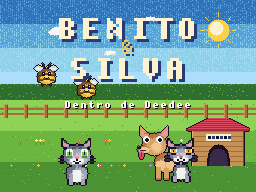

# Benito & Silva: Dentro de Deedee

Un RPG por turnos **homebrew** para **Nintendo DS**, escrito en C con
[BlocksDS](https://blocksds.skylyrac.net/) (libnds + maxmod). Fuertemente
inspirado en la estructura y las sensaciones de *Mario & Luigi: Bowser's
Inside Story*, pero con personajes, arte, música e historia **100 %
originales**. Todo el juego está en **español**.

> Deedee, un chihuahua entrañable, se traga de un lengüetazo a **Terelu**,
> una mosca megalómana que en vez de morir le invade el cerebro. Desde
> entonces Deedee no para de lamerlo todo. Los gatos hermanos **Benito** y
> **Silva** son los únicos lo bastante pequeños y valientes para entrar en
> él (por… la puerta de atrás) y subir órgano a órgano hasta el cerebro.

Todo el pixel art, la música chiptune y los efectos de sonido se **generan
programáticamente desde cero** con Python (ver `tools/`): no se usa ningún
asset con copyright.



---

## Compilar

`make` produce `benito_silva.nds` directamente.

### Requisitos

- **BlocksDS** (devkitARM + libnds + maxmod + grit + ndstool + mmutil).
  Se instala con el toolchain [Wonderful](https://wonderful.asie.pl/):

  ```sh
  # instalador wf-pacman
  wf-pacman -Syu
  wf-pacman -S toolchain-gcc-arm-none-eabi blocksds-toolchain
  # deja BlocksDS accesible en la ruta estándar
  ln -sfn /opt/wonderful/thirdparty/blocksds /opt/blocksds
  ```

  El `Makefile` detecta BlocksDS en `/opt/blocksds/core` o en
  `/opt/wonderful/thirdparty/blocksds/core` automáticamente.

- Para **regenerar** los assets (solo si tocas los generadores):
  `python3` + `Pillow` (`pip install Pillow`).

### Órdenes

```sh
make              # compila benito_silva.nds
make test         # compila y ejecuta los tests de lógica en el PC
make regen-assets # regenera pixel art, música y mapas desde tools/
make clean
```

El `.nds` corre en **melonDS**, **DeSmuME** y en hardware real vía
flashcart (con DLDI para el guardado en SD; también soporta SRAM de la
ranura GBA).

---

## Cómo se juega

El juego usa las **dos pantallas**: la superior muestra la escena/estado y
la inferior (donde ocurre la acción) el mapa o el combate.

### Exploración

- **Cruceta**: mover al líder (Benito). Silva le sigue.
- En el **jardín** (vista cenital): **A** salta / interactúa (hablar,
  cofres, carteles, entrar en Deedee).
- En el **interior** (vista lateral con gravedad): **A** salta,
  **B** interactúa. Los **respiraderos de gas** te impulsan hacia arriba;
  el **ácido** hace daño.
- **START**: menú de estado. **SELECT** dentro del menú: inventario.

### Combate (comandos de acción, estilo BIS)

- **A = Benito**, **B = Silva** en todo momento.
- Al **atacar**, pulsa el botón del gato **justo en el impacto** para
  «¡BIEN!» o «¡EXCELENTE!» (más daño). Un **Salto** excelente rebota y
  golpea dos veces.
- Al **defender**, salta con tu botón **justo antes** del golpe enemigo
  para esquivar; si clavas el momento, **contraatacas**. Cada enemigo
  **telegrafía** a quién va a atacar (señal visual + flecha).
- **Especial** (Bola de Pelo Gemela): minijuego cooperativo que gasta PE.
- Al subir de nivel, **ruleta de bonus** para elegir stat (nivel máx. 33).

---

## Contenido de esta entrega (Hito 1 — vertical slice)

- **Intro cinemática** completa: Terelu tragada, invasión del cerebro,
  el caos de los lametones, el consejo de los abejorros y la entrada
  (resignada) en Deedee.
- **Césped Central**: hub del jardín con 4 NPCs animales de diálogos
  ricos que cambian según el progreso (Doña Baba, Rufo, Nuez, Don Croac),
  un **abejorro tendero**, dos tipos de enemigos, un **puzle** de baldosas
  y un cofre.
- **Recto/Colon**: zona interior tutorial en 3 salas con plataformeo,
  puzle **físico de gases**, puzle **clásico** (bloque + interruptor),
  dos tipos de enemigos y un **jefe** (El Gran Tapón) con cinemática.
- **Combate** completo con comandos de acción, EXP/niveles, ruleta,
  objetos, especial y huida.
- **Música y SFX** originales para todo lo anterior. Guardado en SD/SRAM.

---

## Arquitectura

Código **modular**, con la lógica del combate/progresión separada y
**portable** (se compila y testea en el PC, sin libnds):

```
source/
  main.c                arranque
  engine/               motor (reutilizable)
    video.*             doble pantalla, VRAM, capas, fundidos
    text.*              fuente propia 8x8 con español (tildes y ñ)
    sprites.*           hojas de sprites y OAM
    map.*               mapas tileados con scroll y colisión por metatile
    dialog.*            cajas de diálogo con retrato animado y máquina de escribir
    cutscene.*          cinemáticas dirigidas por guiones declarativos
    fx.*                partículas, números de daño, sacudida de pantalla
    audio.*             música (maxmod) y efectos
    save.*              guardado FAT (SD) / SRAM / memoria
  game/
    game.*              máquina de estados, HUD, guardado de partida
    overworld.*         exploración cenital y lateral
    battle_core.*       LÓGICA de combate (portable, testeable en PC)
    battle_render.*     presentación DS del combate
    player.*            stats y progresión (portable)
    items.*             objetos e inventario (portable)
    npc.*  shop.*  scripts.*   contenido: diálogos, tienda, cinemáticas
  data/                 tablas generadas (mapas, tiles, sprites_meta, fuente)

assets/
  bin/                  gráficos y paleta en formato nativo DS (enlazados por bin2c)
  audio/                módulos .mod y efectos .wav (compilados por mmutil)
  gfx/                  PNGs SOLO para inspección humana (no se compilan)

tools/                  generadores de assets en Python (pixel art, música, mapas)
tests/                  tests de lógica ejecutables en el host (make test)
```

### Los assets se generan por código

Todo el arte es pixel art dibujado programáticamente píxel a píxel
(`tools/pixelkit.py` + `sprites_*.py`, `gen_*.py`), la música son módulos
ProTracker sintetizados (`tools/gen_music.py`) y los efectos son WAV
sintetizados (`tools/gen_sfx.py`). `tools/gen_all.py` los orquesta y emite
los `.bin` nativos y las tablas C. Los `.bin`/`.mod`/`.wav` generados están
versionados, así que **no hace falta Python para compilar el juego**, solo
para regenerarlos.

---

## Verificación

- **`make test`**: 41 comprobaciones de la lógica de combate y progresión
  (daño con timing, victoria/derrota, huida, esquiva/contraataque, jefe,
  ruleta, objetos, PE del especial) ejecutadas en el PC.
- Compila **sin warnings** a `.nds`.
- Probado en **DeSmuME** (título, intro completa, exploración interior,
  tutorial, puzles, combate con comandos de acción).

### Compilaciones de depuración

```sh
make DEFINES="-DDEV_SHORTCUTS"       # atajos en el título: Y=interior, X=combate
make NAME=dbg DEFINES="-DDEBUG_BOOT_BATTLE"   # arranca directo a un combate
```

---

## Hoja de ruta

Tras el hito 1, la aventura continúa órgano a órgano (Intestinos,
Estómago, Riñones, Corazón, Pulmones, Cerebro) con sus puzles físicos,
jefes y las batallas gigantes, más las estancias restantes del jardín,
el control alterno de Deedee y los ataques especiales de hermanos.

---

*Personajes, historia, arte y música originales. Hecho con cariño y
vísceras.*
